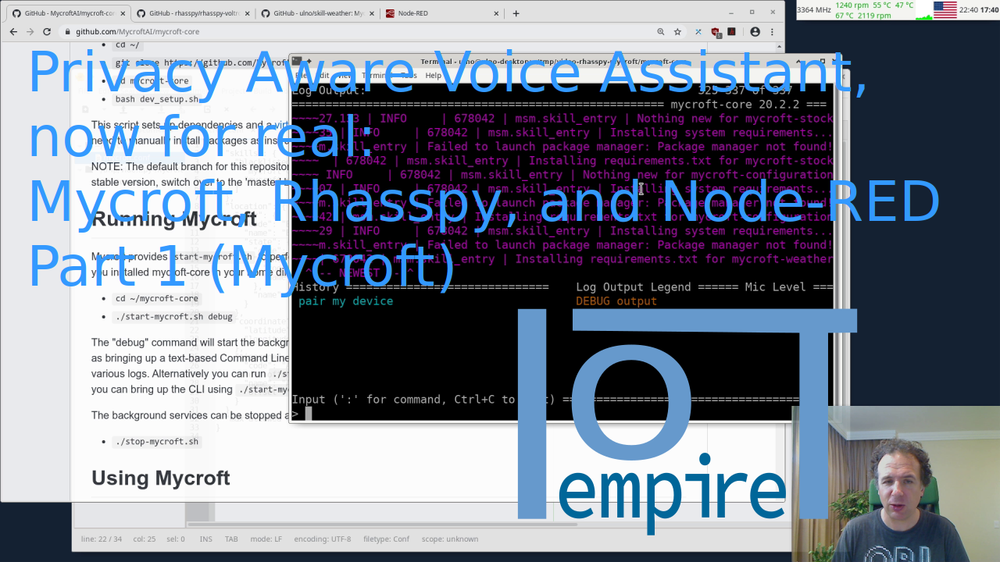

# Privacy Aware Voice Assistant, now for real: Mycroft, Rhasspy, and Node-RED - Part 1 (Mycroft)



**Resources:**
- Video on YouTube: https://youtu.be/-fYOf4WBvzk
- Video on lbry:
- This page: https://github.com/ulno/doc/blob/master/videos/2020-04-25%20Rhasspy%2C%20node-red%2C%20mycroft/part1/desc.md

## Introduction
As you see I am fascinated by voice assistants, but I don't like them sending things into the cloud. Do I really want Google, Amazon, Apple, and Microsoft listen and analyze every word I say in my private four walls? How about voice assistants in an industrial setting - is it OK there to send everything to an external cloud provider? Not sure that such solutions will be easy to sell. And what happens when the Internet is down?

As excited as I initially was with Mycroft (https://mycroft.ai), I was a little disappointed to find out that they use (their own) third party cloud service to do speech to text. However, Mycroft is open source, so it allows me to exchange this service. After discovering Rhasspy (http://rhasspy.org, https://github.com/rhasspy/rhasspy-voltron, a system especially focusing on offline voice assistance).
I still like Mycroft and its community a lot, so what to do?

Hey, I am a software engineer, I thought: "I can glue systems together that don't have explicit interfaces for each other". So, let's use Node-RED (https://nodered.org) as glue!

Follow along in this mini-series. The series has 3 parts and we are starting here with the Mycroft installation:

1. Installation Mycroft: https://youtu.be/-fYOf4WBvzk
2. Installation Rhasspy: https://youtu.be/xKgPrn8ukcM
3. Integration with Node-RED: https://youtu.be/hZwv80gB8f0

If you want to see the rest of the documentation with code examples, check this document here: https://github.com/ulno/doc/blob/master/videos/2020-04-25%20Rhasspy%2C%20node-red%2C%20mycroft/part1/desc.md


## Implementation

We start here with a small introduction (so, if you are impatient jump directly to 2:12 to "Let's get started").

I assume in this series that you have Node-RED installed and running in your network (check out https://nodered.org/docs/getting-started/ or demand an explanation video down in the comments).

In this first part, I show you how to Mycroft for this integration (gluing) task.

You find the first manual at: https://github.com/MycroftAI/mycroft-core

For arch or Manjaro make sure to install these dependencies:
```
sudo pacman -S git python3 python-setuptools python-venv pygobject libtool libffi libjpg openssl autoconf bison swig glib2.0 portaudio19 mpg123 flac curl fann jq
```

Your first commands will be:
```
git clone https://github.com/MycroftAI/mycroft-core.git

bash dev_setup

Y (stable)
Y? (check for updates, you can also answer no)
N (mimic not required, we will use text to speech -TTS- from rhasspy)
Y (allow code-style checking)
```

Then allow root access (enter your user/admin password) too allow Mycroft to create the skill directory in /opt/mycroft as well as download the default skills over there.

Let the install finish.

Here is the `.mycroft/mycroft.conf` example. Adjust it to your needs/location.
```json
{
  "skills": {
    "blacklisted_skills": [
      "mycroft-configuration.mycroftai",
      "mycroft-pairing.mycroftai"
    ]
  },
  "location": {
    "city": {
      "code": "Brasília",
      "name": "Brasília",
      "state": {
        "code": "BR.07",
        "country": {
          "code": "BR",
          "name": "Brazil"
        },
        "name": "Federal District"
      }
    },
    "coordinate": {
      "latitude": -15.763299,
      "longitude": -47.869485
    },
    "timezone": {
      "code": "America/Sao_Paulo",
      "dst_offset": -10800000,
      "name": "America/Sao_Paulo",
      "offset": -7200000
    }
  },
  "max_allowed_core_version": 20.2
}
```

Continue with these commands for doing a first "what's the weather"-test (that will fail).
```bash
./start-mycroft.sh skills
./start-mycroft.sh cli
```
Enter "what's the weather" (and watch errors showing up.
So, let's get your own api key from https://openweathermap.org (and remember the api key).
```bash
./stop-mycroft.sh
```

Get my adapted weather skill:
```
git clone https://github.com/ulno/skill-weather
```
 
Move or link this to /opt/mycroft/skills/mycroft-weather.mycroftai (make sure to backup original skill).

In weather skill add to settings.json add the api key, like this (use your own key - this one here is not valid anymore):
```json
{
	"api_key": "6e4d31ec5155fe8be2d2ad38cc0c2f3b",
	"use_proxy": false, 
	"__mycroft_skill_firstrun": false
}
```

Try it out in Mycroft (start skills and command line interface as above) and type:
```
what's the weather
```
or
```
do i need an umbrella today
```

If everything works here, congratulations and leave a like (and an encouraging comment)! 
If not, feel free to ask in the comments for help (and describe your problem).
Now, you can move on to the next movie on setting up Rhasspy at https://youtu.be/... or the corresponding documentation here: https://github.com/ulno/doc/blob/master/videos/2020-04-25%20Rhasspy%2C%20node-red%2C%20mycroft/part2/desc.md

## End Matter

Links to all projects:
- Mycroft: https://mycroft.ai)
- Rhasspy: http://rhasspy.org, https://github.com/rhasspy/rhasspy-voltron
- Node-RED: https://nodered.org

And don't forget to check these web-sites and my own Instagram account:
- ulno's site: https://ulno.net
- ulno's Instagram: https://www.instagram.com/ulno_net/
- IoTempire: https://iotempire.net

I am also now on lbry, check my channel there too:
lbry://@ulno#2
 
As usual, stay tuned and see you next time!

#makers #IoT #IoTempire #diy #arduino #raspberrypi #opensource #nodered #Node-RED #rhasspy #mycroft #mycroft.ai #privacy #opensource
